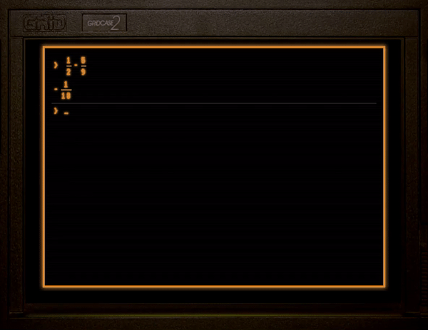

# Retro Computer Fraction Calculator
 Retro Computer Style Fraction Calculator With Multiservices
 
The task of this project was to use a compiled third-party unmanaged C++ DLL and create a front-end app for it in a different programming language. 
Simple ASP.NET service imports a wrapped unmanaged C++ DLL. A Django application serves the front-end to a user that can write any fractions to calculate the sum. From the front-end a REST request containing fractions in a JSON format is made to the Django application that communicates to the ASP.NET service in a similar fashion and returns the calculation result.

## Example 1. Calculator in use (web browser)

## Example 2. Error when calculation service goes offline
